# For the Document

## Notes

- When the model focuses on 1 or two classification it is an indication of overfitting
- Try to balance out the metrics
- One higher metrics reduces the score to other metrics

### Made an algorithm where it tests the prediction and computes the total accuracy and precision

- Measured the accuracy, precision, recall, and F1

### Epochs change without MaxPool2D()

1 Epoch
Accuracy: 0.29591836734693877
Precision: 0.1881546269301371
Recall: 0.29591836734693877
F1 Score: 0.14918890633176346

25 Epochs

Accuracy: 0.3469387755102041
Precision: 0.3477267126874227
Recall: 0.3469387755102041
F1 Score: 0.3348622160886722

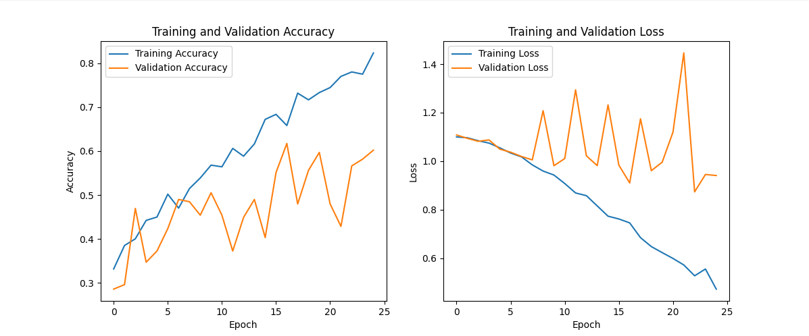

50 Epochs **Original**

Accuracy: 0.37244897959183676
Precision: 0.3679675705898798
Recall: 0.37244897959183676
F1 Score: 0.3698387351663139

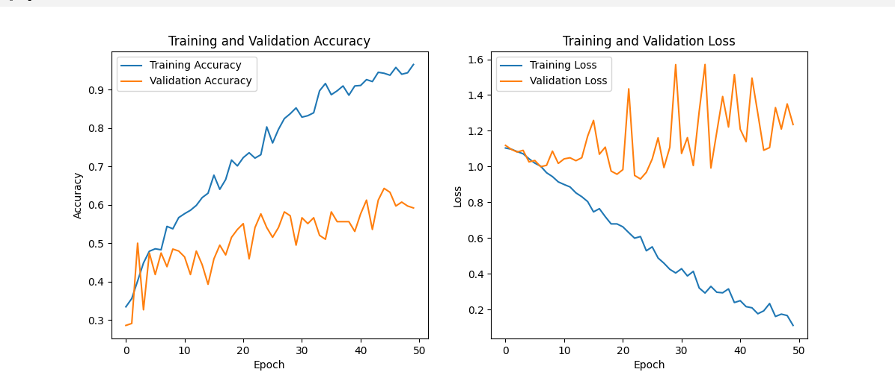

75 Epochs
Accuracy: 0.2857142857142857
Precision: 0.08205128205128205
Recall: 0.2857142857142857
F1 Score: 0.12749003984063745

**100 Epochs**

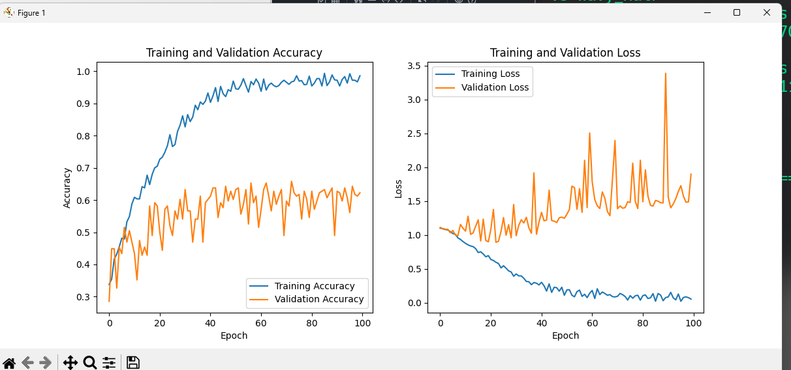

========================================================
Correct:
  Curly_Hair: 321

  Straight_Hair: 257

  Wavy_Hair: 315

Incorrect:
  Curly_Hair: 11

  Straight_Hair: 63

  Wavy_Hair: 16

========================================================
Accuracy: 0.29591836734693877
Precision: 0.3284484242755528
Recall: 0.29591836734693877
F1 Score: 0.2745882126066458

Reason:
 your neural network may overfit, meaning that it will memorize the training data and lose its ability to generalize to new and unseen data

Understanding: Theres too many passes that it concatinates too much information confusing the model on which specific infromation to look for

### Epochs change with MaxPool2D

50 Epochs

Accuracy: 0.3469387755102041
Precision: 0.21843342193389495
Recall: 0.3469387755102041
F1 Score: 0.25543516844789826

Accuracy: 0.30612244897959184
Precision: 0.29926890296348424
Recall: 0.30612244897959184
F1 Score: 0.29962980448207066

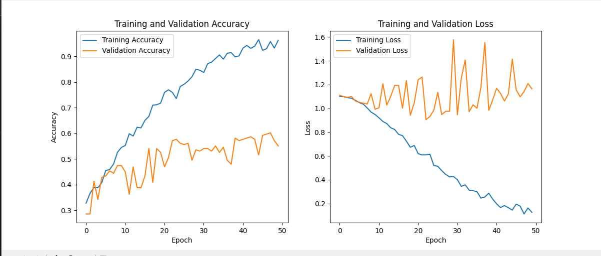

25 Epochs

Accuracy: 0.34183673469387754
Precision: 0.3038265306122449
Recall: 0.34183673469387754
F1 Score: 0.26397687531978414

Accuracy: 0.35714285714285715
Precision: 0.23524145133548388
Recall: 0.35714285714285715
F1 Score: 0.277020172230742

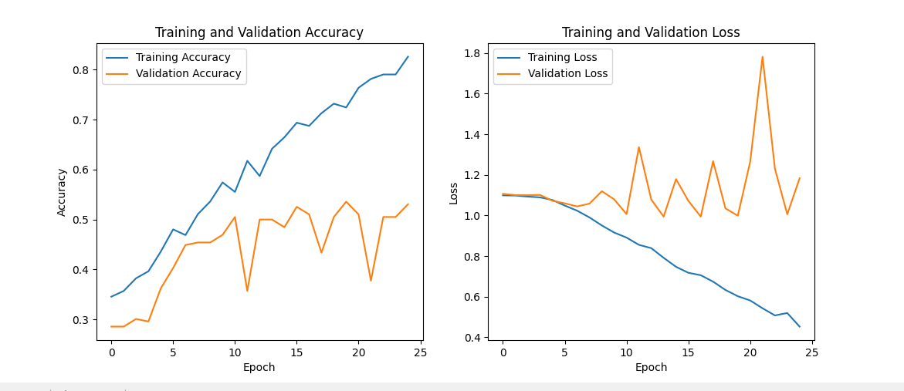

10 Epochs
Accuracy: 0.2857142857142857
Precision: 0.08163265306122448
Recall: 0.2857142857142857
F1 Score: 0.12698412698412698

Accuracy: 0.34183673469387754
Precision: 0.22390749489424014
Recall: 0.34183673469387754
F1 Score: 0.269533527696793'

**100 Epochs**

========================================================
Correct:
  Curly_Hair: 311

  Straight_Hair: 301

  Wavy_Hair: 243

Incorrect:
  Curly_Hair: 21

  Straight_Hair: 19

  Wavy_Hair: 88

========================================================
Accuracy: 0.3163265306122449
Precision: 0.3103723818009532
Recall: 0.3163265306122449
F1 Score: 0.2926718123146695

Concluded that when applying max pooling Reduce the epochs to 25 and apply MaxPool

Reason: Max pool layer gets the largest value in the kernel. When the kernel passes through the whole image it retains the shape and intensity of the expanded resolution on a smaller value. Too much training could lead to overfitting

Understanding: Balance out the number of epochs and MaxPooling since it could lead to overfitting. Too many passes the model could just foocus specifically on the retained patterns of the image.

### Also made a manual for loop for each image to observe how does the model predicts correctly and incorrectly

- This can be inaccurate with the initial metrics applied in the model

### First and 3rd Layer filters are flipped without MaxPool2D()

Accuracy: 0.2857142857142857
Precision: 0.08163265306122448
Recall: 0.2857142857142857
F1 Score: 0.12698412698412698

Understanding: Greater filters meaning more channels depth taht could lead to the reduciton of spatial resolution

### Doubled the filter in each later without MaxPooling2D

Accuracy: 0.3469387755102041
Precision: 0.37381153275421436
Recall: 0.3469387755102041
F1 Score: 0.29374854626144964

Accuracy: 0.39285714285714285
Precision: 0.4140007354293069
Recall: 0.39285714285714285
F1 Score: 0.3517386808203135

### Doubled the filter in each layer with MaxPooling 2D

Accuracy: 0.34183673469387754
Precision: 0.3052596038415366
Recall: 0.34183673469387754
F1 Score: 0.2678772322905736

Accuracy: 0.4030612244897959
Precision: 0.4227268090763116
Recall: 0.4030612244897959
F1 Score: 0.4061858697265813

Reason: MaxPooling compliments the increase of filters because it maintains the strucgture and the important features through getting the max value of every kernel. With more features obtained therefore more accuracy

**Same setup but with 30 epochs**
Accuracy: 0.2857142857142857
Precision: 0.08163265306122448
Recall: 0.2857142857142857
F1 Score: 0.12698412698412698

**Same setup but with 23 epochs**

Accuracy: 0.3622448979591837
Precision: 0.36115362811791385
Recall: 0.3622448979591837
F1 Score: 0.35983576100385

### Switched Kernel size of the first and last layer

Accuracy: 0.3469387755102041
Precision: 0.3278013403163463
Recall: 0.3469387755102041
F1 Score: 0.2974178703067482

Accuracy: 0.3520408163265306
Precision: 0.36762811627836617
Recall: 0.3520408163265306
F1 Score: 0.34801539306904045

### Added a new layer

**25 Epochs**
Accuracy: 0.3469387755102041
Precision: 0.3278013403163463
Recall: 0.3469387755102041
F1 Score: 0.2974178703067482

Accuracy: 0.33163265306122447
Precision: 0.34582907617475744
Recall: 0.33163265306122447
F1 Score: 0.32364143868870626

**10 Epochs**
Accuracy: 0.3622448979591837
Precision: 0.13122136609745938
Recall: 0.3622448979591837
F1 Score: 0.192654589925858

**18 Epochs**
Accuracy: 0.3877551020408163
Precision: 0.3827212123465051
Recall: 0.3877551020408163
F1 Score: 0.38402725094454415

**16 Epochs**

Accuracy: 0.3673469387755102
Precision: 0.3922008283650539
Recall: 0.3673469387755102
F1 Score: 0.3575349392778134

Understanding: More layers requres lesser epochs. Large epochs leads to overfitting

### Change of learning rate ADAM

1e-3

Accuracy: 0.39285714285714285
Precision: 0.3850461613216715
Recall: 0.39285714285714285
F1 Score: 0.333656713917094

1e-0

Precision: 0.12393273635985007
Accuracy: 0.3520408163265306
Precision: 0.12393273635985007
Recall: 0.3520408163265306
F1 Score: 0.18332691567192916

1e-5

Accuracy: 0.30612244897959184
Precision: 0.1915709417229174
Recall: 0.30612244897959184
F1 Score: 0.21847795938417944

1e-4

Accuracy: 0.3673469387755102
Precision: 0.5336631021551217
Recall: 0.3673469387755102
F1 Score: 0.3241106073016011

Understanding: Lower learning rate means more training time. Too much training time becomes overfitting. Higer learning rate is less training time which reduces accuracy

### Change of Optimizer RMSProp 1e-3

**Adam (original)**
Accuracy: 0.3979591836734694
Precision: 0.4150057219149342
Recall: 0.3979591836734694
F1 Score: 0.36959477490337855

**RMSProp**

Accuracy: 0.37755102040816324
Precision: 0.3623102465087515
Recall: 0.37755102040816324
F1 Score: 0.3437330826349261

### Change of Optimizer RMSProp

1e-2
Accuracy: 0.2857142857142857
Precision: 0.08163265306122448
Recall: 0.2857142857142857
F1 Score: 0.12698412698412698

1e-5
Accuracy: 0.33163265306122447
Precision: 0.3268485390578414
Recall: 0.33163265306122447
F1 Score: 0.32544783618031253

### Same Kernel Size

Accuracy: 0.39285714285714285
Precision: 0.2475452445128995
Recall: 0.39285714285714285
F1 Score: 0.2950446233539288

**3x3**

Accuracy: 0.3979591836734694
Precision: 0.3939435612519941
Recall: 0.3979591836734694
F1 Score: 0.38078530330346316

**5x5**

Accuracy: 0.37755102040816324
Precision: 0.3649562776683667
Recall: 0.37755102040816324
F1 Score: 0.36219608869760955

**5x5 but with 25 Epochs**

Accuracy: 0.3163265306122449
Precision: 0.3301237959298552
Recall: 0.3163265306122449
F1 Score: 0.30229572890664674

### Application of GlobalMaxPooling2D

Accuracy: 0.3520408163265306
Precision: 0.3453050634173083
Recall: 0.3520408163265306
F1 Score: 0.3370696316355063

Accuracy: 0.32142857142857145
Precision: 0.3277438248026483
Recall: 0.32142857142857145
F1 Score: 0.3066358427607462

**25 Epochs**

Accuracy: 0.336734693877551
Precision: 0.32507726009859544
Recall: 0.336734693877551
F1 Score: 0.3153468279844453

**50 Epochs**
Accuracy: 0.3877551020408163
Precision: 0.40763033520662895
Recall: 0.3877551020408163
F1 Score: 0.378348684606586

**75 Epochs**

Accuracy: 0.3010204081632653
Precision: 0.3100926493543789
Recall: 0.3010204081632653
F1 Score: 0.29361295029805423

**50 Epochs with extra layer**

Accuracy: 0.3622448979591837
Precision: 0.36146137026239067
Recall: 0.3622448979591837
F1 Score: 0.3614244519185443

### The Value of the filter is switched

**Increasing 8 16 32 64**
Accuracy: 0.3979591836734694
Precision: 0.3864960877968209
Recall: 0.3979591836734694
F1 Score: 0.38573328651766564

**Decreasing 64 32 16 8**

Accuracy: 0.3520408163265306
Precision: 0.41192419825072885
Recall: 0.3520408163265306
F1 Score: 0.34247525544386564

# Pre processing

### Image sharpening

Accuracy: 0.32653061224489793
Precision: 0.33318449179654147
Recall: 0.32653061224489793
F1 Score: 0.32602511050503147

Accuracy: 0.336734693877551
Precision: 0.34416981922792755
Recall: 0.336734693877551
F1 Score: 0.33393869740351034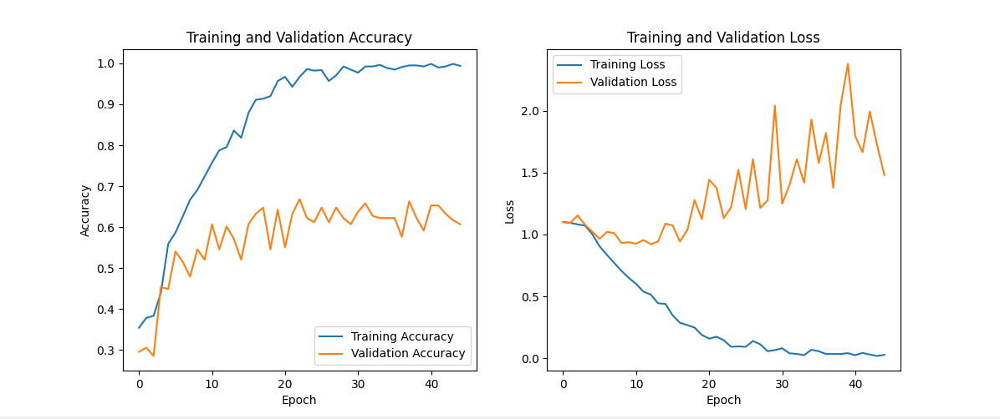

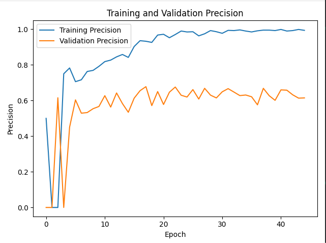

### Early Stopping

**Before**

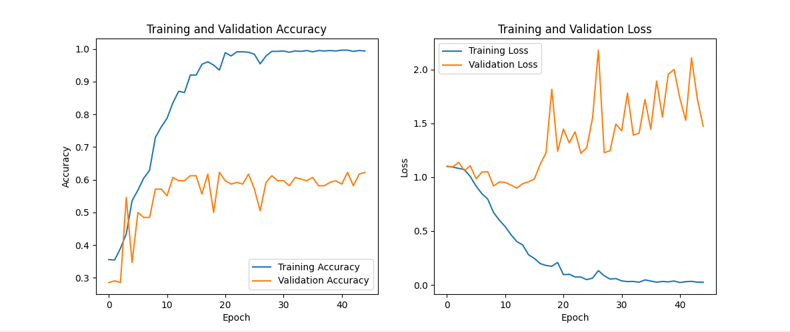

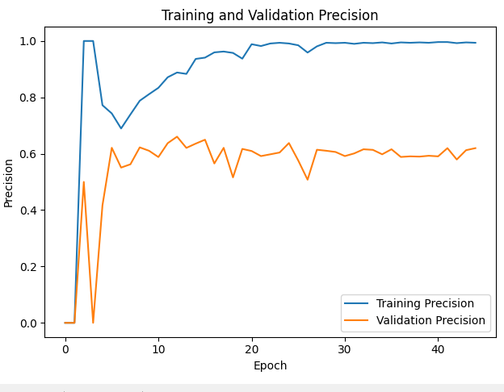

Curly count: 332
Stright count: 320
Wavy count: 331
========================================================
Correct:
  Curly_Hair: 316

  Straight_Hair: 291

  Wavy_Hair: 273

Incorrect:
  Curly_Hair: 16

  Straight_Hair: 29

  Wavy_Hair: 58

========================================================
Accuracy: 0.35714285714285715
Precision: 0.3585082955383707
Recall: 0.35714285714285715
F1 Score: 0.3574072660811339

**After**

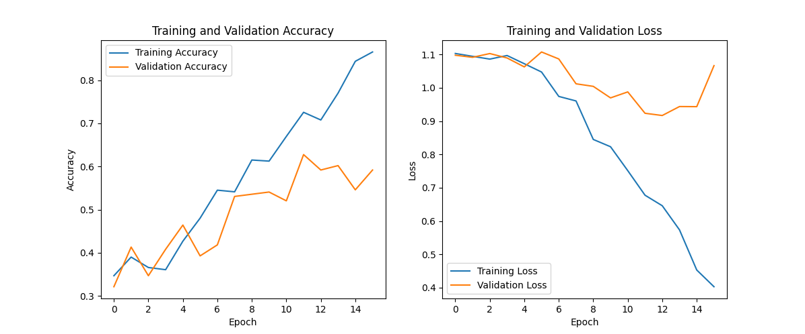
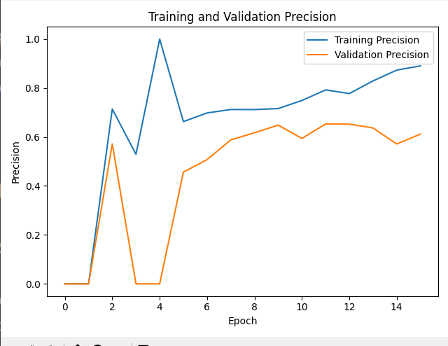

Curly count: 332
Stright count: 320
Wavy count: 331
========================================================
Correct:
  Curly_Hair: 321

  Straight_Hair: 174

  Wavy_Hair: 280

Incorrect:
  Curly_Hair: 11

  Straight_Hair: 146

  Wavy_Hair: 51

========================================================
Accuracy: 0.28061224489795916
Precision: 0.30409722268401224
Recall: 0.28061224489795916
F1 Score: 0.2648398841133724

**10 Patience**

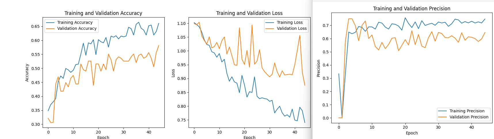

Curly count: 332
Stright count: 320
Wavy count: 331
========================================================
Correct:
  Curly_Hair: 259

  Straight_Hair: 214

  Wavy_Hair: 163

Incorrect:
  Curly_Hair: 73

  Straight_Hair: 106

  Wavy_Hair: 168

========================================================
Accuracy: 0.3673469387755102
Precision: 0.36418678048142333
Recall: 0.3673469387755102
F1 Score: 0.36484096833951063